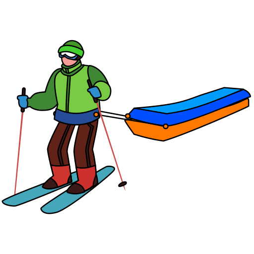
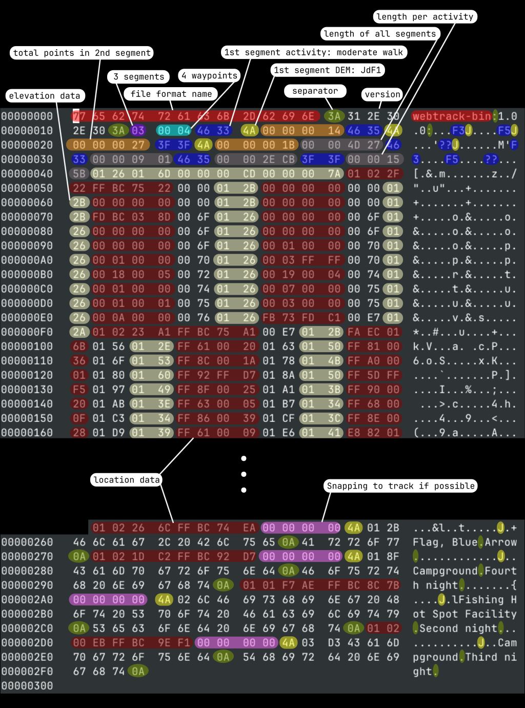

# WebTrack Format Spec

-   **Name:** WebTrack
-   **Extension:** .webtrack
-   **MIME Type:** application/prs.webtrack
-   **Support:** tracks and/or waypoints
-   **Algorithm Type:** lossy (quantization)

**Notes:**

-   Part of the file is human-readable (UTF8/ASCII) to ease debugging but most data are in binary for space optimization and modern browsers handle it with the JavaScript [ArrayBuffer](https://developer.mozilla.org/en-US/docs/Web/JavaScript/Reference/Global_Objects/ArrayBuffer "JavaScript ArrayBuffer").
-   Numbers are stored in big-endian “because Internet standards usually require data to be stored big-endian, starting at the standard UNIX socket level and going all the way up to standardized Web binary data structures.” Source: [MDN web docs](https://developer.mozilla.org/en-US/docs/Glossary/Endianness "Endianness").

## Format Information

General information about the file format and content.

<table>
    <thead>
        <tr>
            <th>Name</th>
            <th>Description</th>
            <th>Type / Length</th>
            <th>Value / Example</th>
        </tr>
    </thead>
    <tbody>
        <tr>
            <td>Format Name</td>
            <td>It is a binary webtrack file</td>
            <td>Some ASCII bytes</td>
            <td>webtrack-bin</td>
        </tr>
        <tr>
            <td>Separator</td>
            <td>A simple character in-between</td>
            <td>1 ASCII byte</td>
            <td>:</td>
        </tr>
        <tr>
            <td>Format Version</td>
            <td>The webtrack version we are dealing with</td>
            <td>Some ASCII bytes</td>
            <td>1.0.0</td>
        </tr>
        <tr>
            <td>Separator</td>
            <td>A simple character in-between</td>
            <td>1 ASCII byte</td>
            <td>:</td>
        </tr>
        <tr>
            <td>Number of Segments</td>
            <td>The total number of segment headers</td>
            <td>uint8</td>
            <td><code>0x01</code></td>
        </tr>
        <tr>
            <td>Number of Waypoints</td>
            <td>The total number of waypoints</td>
            <td>uint16</td>
            <td><code>0x0004</code></td>
        </tr>
    </tbody>
</table>

## Segment Headers

Information intended to know at the beginning how much data we are dealing with, so that the application could proceed to the array allocation. Each segment is defined as below. There are as many segments as desired.

<table>
    <thead>
        <tr>
            <th>Name</th>
            <th>Description</th>
            <th>Type / Length</th>
            <th>Value / Example</th>
        </tr>
    </thead>
    <tbody>
        <tr>
            <td rowspan="33">Activity</td>
            <td> Undefined</td>
            <td rowspan="33">2 ASCII bytes</td>
            <td>??</td>
        </tr>
        <tr>
            <td> Packraft</td>
            <td>A?</td>
        </tr>
        <tr>
            <td>Bus</td>
            <td>B?</td>
        </tr>
        <tr>
            <td>Car</td>
            <td>C?</td>
        </tr>
        <tr>
            <td>Sled dog</td>
            <td>D?</td>
        </tr>
        <tr>
            <td>Electric bicycle</td>
            <td>E?</td>
        </tr>
        <tr>
            <td> Walk</td>
            <td>F?</td>
        </tr>
        <tr>
            <td>Sunday School Picnic walk</td>
            <td>F1</td>
        </tr>
        <tr>
            <td>Easy walk</td>
            <td>F2</td>
        </tr>
        <tr>
            <td>Moderate walk</td>
            <td>F3</td>
        </tr>
        <tr>
            <td>Difficult walk</td>
            <td>F4</td>
        </tr>
        <tr>
            <td>Challenging walk</td>
            <td>F5</td>
        </tr>
        <tr>
            <td>Running</td>
            <td>G?</td>
        </tr>
        <tr>
            <td>Hitchhiking</td>
            <td>H?</td>
        </tr>
        <tr>
            <td>Motorbike</td>
            <td>I?</td>
        </tr>
        <tr>
            <td>Kayak</td>
            <td>K?</td>
        </tr>
        <tr>
            <td>Canoe</td>
            <td>L?</td>
        </tr>
        <tr>
            <td> Motored boat</td>
            <td>M?</td>
        </tr>
        <tr>
            <td>Bicycle</td>
            <td>O?</td>
        </tr>
        <tr>
            <td>Snow mobile</td>
            <td>Q?</td>
        </tr>
        <tr>
            <td> Rowing boat</td>
            <td>R?</td>
        </tr>
        <tr>
            <td> Ski</td>
            <td>S?</td>
        </tr>
        <tr>
            <td>Train</td>
            <td>T?</td>
        </tr>
        <tr>
            <td>Horse</td>
            <td>V?</td>
        </tr>
        <tr>
            <td>Sailing boat</td>
            <td>W?</td>
        </tr>
        <tr>
            <td>Snow shoes</td>
            <td>X?</td>
        </tr>
        <tr>
            <td>Swim</td>
            <td>Y?</td>
        </tr>
        <tr>
            <td>Via ferrata</td>
            <td>Z?</td>
        </tr>
        <tr>
            <td>Easy via ferrata</td>
            <td>ZA</td>
        </tr>
        <tr>
            <td>Moderately difficult via ferrata</td>
            <td>ZB</td>
        </tr>
        <tr>
            <td>Difficult via ferrata</td>
            <td>ZC</td>
        </tr>
        <tr>
            <td>Very difficult via ferrata</td>
            <td>ZD</td>
        </tr>
        <tr>
            <td>Extremely difficult via ferrata</td>
            <td>ZE</td>
        </tr>
        <tr>
            <td rowspan="6">Elevation Model</td>
            <td>Segment with elevation (from SRTMGL1v3)</td>
            <td rowspan="6">1 ASCII byte</td>
            <td>E</td>
        </tr>
        <tr>
            <td>Segment with elevation (from ASTGTMv3)</td>
            <td>G</td>
        </tr>
        <tr>
            <td>Segment with elevation (from Jonathan de Ferranti 1")</td>
            <td>J</td>
        </tr>
        <tr>
            <td>Segment with elevation (from Jonathan de Ferranti 3")</td>
            <td>K</td>
        </tr>
        <tr>
            <td>Segment with elevation (from Mapbox)</td>
            <td>M</td>
        </tr>
        <tr>
            <td>Segment without elevation data</td>
            <td>F</td>
        </tr>
        <tr>
            <td>Number of Points</td>
            <td>The total amount of points</td>
            <td>uint32</td>
            <td><code>0x00000080</code> (128 points)</td>
        </tr>
    </tbody>
</table>

**Notes:**

-   The above table is repeated as many times as there are segments.
-   The activity is sourced from the `<desc/>` tag in the `<trk/>` track. The description should contain something like `(Webtrack activity: Moderate walk)`. If using Viking, right-click on the track, click Properties > Properties > General > Description. If using QMapShack, right-click on the track, click Edit > Description.

## Track Information

Overall information about the segments (one summary for all segments combined):

<table>
    <thead>
        <tr>
            <th>Name</th>
            <th>Description</th>
            <th>Type / Length</th>
            <th>Value / Example</th>
        </tr>
    </thead>
    <tbody>
        <tr>
            <td>Total Length</td>
            <td>Total length (m)</td>
            <td>uint32</td>
            <td><code>0x0000A1F4</code> (41,460 m)</td>
        </tr>
        <tr>
            <td>(Activity)</td>
            <td>As listed above</td>
            <td>2 ASCII bytes</td>
            <td>F3</td>
        </tr>
        <tr>
            <td>(Activity Length)</td>
            <td>Length (m) of all segments from the same activity</td>
            <td>uint32</td>
            <td><code>0x00000901</code> (2305 m) of moderate walk</td>
        </tr>
        <tr>
            <td>...</td>
            <td>...</td>
            <td>...</td>
            <td>...</td>
        </tr>
        <tr>
            <td>(Activity)</td>
            <td>As listed above</td>
            <td>2 ASCII bytes</td>
            <td>R?</td>
        </tr>
        <tr>
            <td>(Activity Length)</td>
            <td>Length (m) of all segments from the same activity</td>
            <td>uint32</td>
            <td><code>0x00002ECB</code> (11979 m) of rowing boat</td>
        </tr>
        <tr>
            <td>Minimum Altitude</td>
            <td>The lowest point (m)</td>
            <td>int16</td>
            <td><code>0x0123</code> (291 m)</td>
        </tr>
        <tr>
            <td>Maximum Altitude</td>
            <td>The highest point (m)</td>
            <td>int16</td>
            <td><code>0x02D7</code> (727 m)</td>
        </tr>
        <tr>
            <td>Elevation Gain</td>
            <td>Total elevation gain (m)</td>
            <td>uint32</td>
            <td><code>0x00000337</code> (823 m)</td>
        </tr>
        <tr>
            <td>Elevation Loss</td>
            <td>Total elevation loss (m) unsigned</td>
            <td>uint32</td>
            <td><code>0x000002D6</code> (726 m)</td>
        </tr>
    </tbody>
</table>

The activity and length per activity are excluded if there is only one activity in the entire Webtrack track.

That section doesn't exist if the file does not contain any track. The length is the rounded sum of each WebTrack segment length, i.e. gaps between segments are not taken into account. The elevation values are skipped if missing on all tracks.

## Points

The latitude and longitude are not projected (EPSG:4326, WGS84, GPS), values are multiplied by 1e5 and rounded (same as the default Polyline encoder). The altitude is in meters above mean sea level ([EGM96 geoid](https://en.wikipedia.org/wiki/Geoid "Mean Sea Level Definition")) which is used by the [SRTM](https://en.wikipedia.org/wiki/Shuttle_Radar_Topography_Mission "Shuttle Radar Topography Mission"). The cumulated distance is included in order to draw an elevation chart. It is computed by summing the distance between each GPS point (not rounded) with the [haversine formula](https://en.wikipedia.org/wiki/Haversine_formula "Haversine formula") using the Earth mean radius as defined by the International Union of Geodesy and Geophysics (IUGG). The elevation is not taken into account in the cumulated distance. Numbers are rounded just before to be saved in the ArrayBuffer.

### Segment (With Elevation)

If the elevation is included, all points (in the WebTrack segment) must include the elevation information. If the elevation is excluded, not a single point (in the WebTrack segment) will contain elevation data. A WebTrack segment is not equivalent to a GPX segment. Indeed, a track with partial elevation data is splitted into WebTrack segments whereas GPX segments are merged together (i.e. the [`<trkseg/>`](https://www.topografix.com/GPX/1/1/#type_trksegType "GPX <trkseg/> definition") tags in the GPX file are joined together). It means that there is a straight connection between two points even if the GPS receiver was turned off or if the GPS reception was lost in-between those two points.

Similarly to the Google Polyline, points only include the offset from the previous point (except the first point). The offset formula is based on the Mapbox & Development Seed [implementation of the Polyline](https://github.com/mapbox/polyline "JavaScript library").

One WebTrack segment is defined as below:

<table>
    <thead>
        <tr>
            <th colspan="2">Name</th>
            <th>Type / Length</th>
            <th>Example</th>
        </tr>
    </thead>
    <tbody>
        <tr>
            <td rowspan="4">First Point</td>
            <td>Longitude</td>
            <td>int32</td>
            <td><code>0x011F68C4</code> (18835652)</td>
        </tr>
        <tr>
            <td>Latitude</td>
            <td>int32</td>
            <td><code>0xFFABFA4B</code> (-5506485)</td>
        </tr>
        <tr>
            <td>Cumulated Distance (10 m unit)</td>
            <td>uint32</td>
            <td><code>0x00000000</code> (0 m)</td>
        </tr>
        <tr>
            <td>(Elevation)</td>
            <td>int16</td>
            <td><code>0x0127</code> (295 m)</td>
        </tr>
        <tr>
            <td rowspan="4">Second Point</td>
            <td>Offset in longitude from the first point</td>
            <td>int16</td>
            <td><code>0xFF81</code> (-127 m)</td>
        </tr>
        <tr>
            <td>Offset in latitude from the first point</td>
            <td>int16</td>
            <td><code>0x0039</code> (57 m)</td>
        </tr>
        <tr>
            <td>Cumulated Distance (10 m unit)</td>
            <td>uint32</td>
            <td><code>0x00000220</code> (5,440 m)</td>
        </tr>
        <tr>
            <td>(Elevation of the point)</td>
            <td>int16</td>
            <td><code>0x014F</code> (335 m)</td>
        </tr>
        <tr>
            <td>...</td>
            <td>...</td>
            <td>...</td>
            <td>...</td>
        </tr>
        <tr>
            <td rowspan="4">Last Point</td>
            <td>Offset in longitude from the previous point</td>
            <td>int16</td>
            <td><code>0x007C</code> (124 m)</td>
        </tr>
        <tr>
            <td>Offset in latitude from the previous point</td>
            <td>int16</td>
            <td><code>0xFFAF</code> (-81 m)</td>
        </tr>
        <tr>
            <td>Cumulated Distance (10 m unit)</td>
            <td>uint32</td>
            <td><code>0x00001032</code> (41,460 m)</td>
        </tr>
        <tr>
            <td>(Elevation of the point)</td>
            <td>int16</td>
            <td><code>0x0188</code> (392 m)</td>
        </tr>
    </tbody>
</table>

**Note:** The above table is repeated as many times as there are points.

### Waypoints (With Elevation)

Waypoints are all absolutely positioned (no offset). So it's basically a list of sections as defined below.

<table>
    <thead>
        <tr>
            <th>Name</th>
            <th>Type / Length</th>
            <th>Example</th>
        </tr>
    </thead>
    <tbody>
        <tr>
            <td>Longitude</td>
            <td>int32</td>
            <td><code>0x011F2B08</code> (18819848)</td>
        </tr>
        <tr>
            <td>Latitude</td>
            <td>int32</td>
            <td><code>0xFFAC1E92</code> (-5497198)</td>
        </tr>
        <tr>
            <td rowspan="2">(Index of soonest/nearest point)</td>
            <td rowspan="2">uint32</td>
            <td><code>0x00001256</code> (4694th point)</td>
        </tr>
        <tr>
            <td><code>0x00000000</code> if unknown</td>
        </tr>
        <tr>
            <td>With Elevation</td>
            <td rowspan="2">1 ASCII byte</td>
            <td>E/G/J/K/M</td>
        </tr>
        <tr>
            <td>Without Elevation</td>
            <td>F</td>
        </tr>
        <tr>
            <td>(Elevation)</td>
            <td>int16</td>
            <td><code>0x0272</code> (626 m)</td>
        </tr>
        <tr>
            <td>(Symbole)</td>
            <td>Some UTF-8 bytes</td>
            <td>Fishing Hot Spot Facility</td>
        </tr>
        <tr>
            <td>Separator</td>
            <td>1 ASCII byte</td>
            <td>Line Feed</td>
        </tr>
        <tr>
            <td>(Name)</td>
            <td>Some UTF-8 bytes</td>
            <td>Second night</td>
        </tr>
        <tr>
            <td>Separator</td>
            <td>1 ASCII byte</td>
            <td>Line Feed</td>
        </tr>
    </tbody>
</table>

**Notes:**

-   The above table is repeated as many times as there are waypoints.
-   The index of the soonest/nearest point is the index of the point that has been logged in the shortest timelaps or closest according the GPX file, if the time is missing, it is using the closest point. The field is discarded if the Webtrack track does not contain any point. The value is 0 if the waypoint is considered too far from the track to be _snapped_. Such information is useful to locate the waypoint on an elevation profile chart.

## Example

To sum up the different headers and blocks, below is a WebTrack file:

