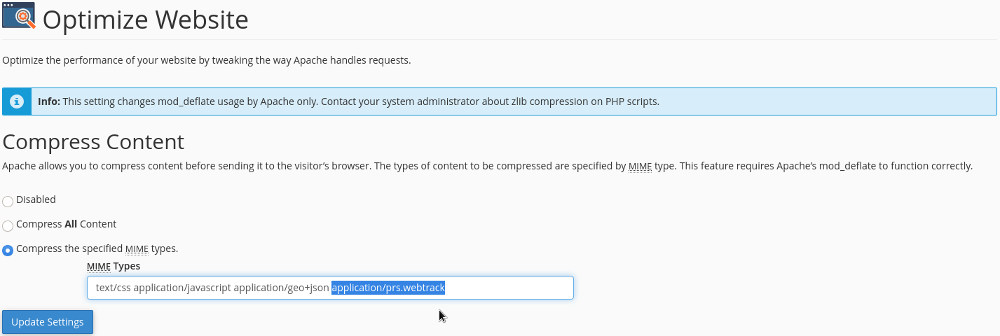
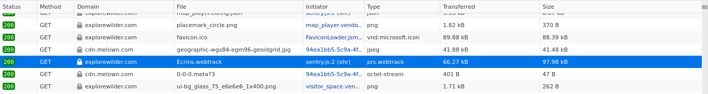

# Enable Apache mod_deflate With cPanel

## Configure

In order to compress the WebTrack with the native Apache compression, you need to specify the WebTrack MIME type in your cPanel:

**Notice:** that only works if you send the _.webtrack_ file with the _application/prs.webtrack_ MIME type.

## Check

You can see the result from your browser:

