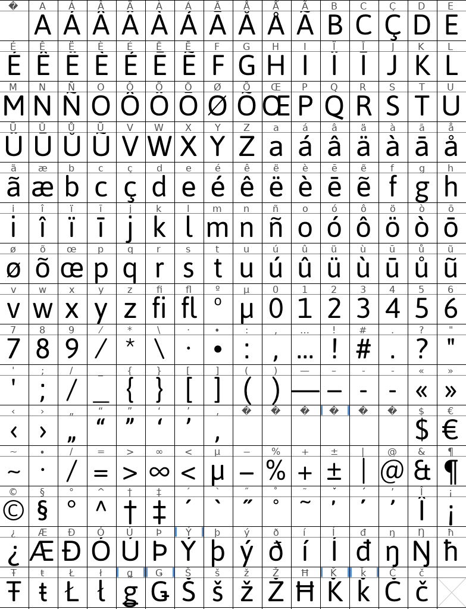

The ExploreWilder font is based on Asap under the [SIL Open Font License](SIL_Open_Font_License.txt). The font is renamed to ExploreWilder to comply with the license (the font is free to use, modify and distribute, but the font name is reserved). Many glyphs have been removed to reduce the file size. Supported languages are Māori, French, Spanish, English, Finnish, Swedish, Norwegian, Southern Sámi, Ume Sámi, Pite Sámi, Lule Sámi, Northern Sámi, Inari Sámi. The software used to edit the font and convert into WOFF2 is [FontForge](https://fontforge.org). Open the sld files with FontForge to edit the fonts.

Note: When I first downloaded the otf font, I used [this online WOFF2 generator](https://www.fontsquirrel.com/tools/webfont-generator) (options: enable 'Fix GASP Table', do not remove kerning). However, this tool removed the Māori characters. I would therefore recommend using FontForge even if you don't edit any glyph/character.

