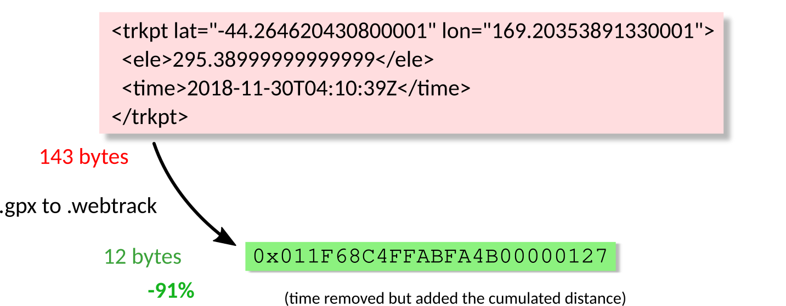

# GPX to WebTrack

## Why The WebTrack Format?

**What GPS data interchange format should you use for a web application?**

The [GPX](https://en.wikipedia.org/wiki/GPS_Exchange_Format "GPS Exchange Format") and [KML](https://en.wikipedia.org/wiki/Keyhole_Markup_Language "Keyhole Markup Language") formats are part of the [XML](https://en.wikipedia.org/wiki/XML "Extensible Markup Language") family, quite verbose. The [Google Encoded Polyline Algorithm Format](https://developers.google.com/maps/documentation/utilities/polylinealgorithm "Polyline Format") is the opposite: very lightweight but contains only one line, had neither elevation data, nor waypoints. The [GeoJSON](https://en.wikipedia.org/wiki/GeoJSON "GeoJSON Format") format has [all features](https://tools.ietf.org/html/rfc7946#section-3.1.1 "The GeoJSON Format Spec") but lacks of extensibility, and it is relatively heavy. [Vector tilesets](https://docs.mapbox.com/help/glossary/tileset/#vector-tilesets "Vector tilesets definition") are great but over-killed (and expensive) to implement for just a bunch of tracks. The [ProtocolBuffer Binary Format](https://github.com/protocolbuffers/protobuf/) is the most attractive solution for transferring GPS tracking data and a JavaScript library [exists](https://github.com/mapbox/pbf "JavaScript library for the Google Protobuf"), but a high-level interface managing tracks and waypoints as well as reading GPX data is still needed. This project aims to fill the gap between the rich GPX file and the simple Google polyline. This repo includes a GPX to WebTrack exporter with an [elevation data](DEM.md) fetcher. A WebTrack to GeoJSON exporter is available in TypeScript and you can see a real-world example with Mapbox in [ExploreWilder.com](https://explorewilder.com).

**[Read the format specifications](SPEC.md)**.

**Note:** The [GPX Track Segments](https://www.topografix.com/GPX/1/1/#type_trksegType "GPX <trkseg/> definition") are merged.

**How efficient is the compression?**

No benchmark, but the result is good enough:



## Prerequisites

* Python 3.11,
* GDAL for Python - to handle GeoTIFF images from ASTGTM v3,
* Jonathan de Ferranti HGT files - if using that dataset.

> If GDAL is installed system-wide, configure the virtual environment to also use the global site packages.

> For the Jonathan de Ferranti dataset, please download it yourself and put it in the cache folder with the file format: *N64E025_JdF1.hgt* if setting *JdF1* as input parameter.

* To access the SRTMGL1 v3 and ASTGTM v3 datasets, you need to accept the terms:

```
********************************************************************************

                         U.S. GOVERNMENT COMPUTER

This US Government computer is for authorized users only.  By accessing this
system you are consenting to complete monitoring with no expectation of privacy.
Unauthorized access or use may subject you to disciplinary action and criminal
prosecution.

Attention user: You are downloading data from NASA's Land Processes Distributed
Active Archive Center (LP DAAC) located at the USGS Earth Resources Observation and
Science (EROS) Center.

Downloading these data requires a NASA Earthdata Login username and password.
To obtain a NASA Earthdata Login account, please visit
https://urs.earthdata.nasa.gov/users/new/.

For more information about the data you are downloading, including documentation
and how to properly cite the data, please visit https://lpdaac.usgs.gov/.

********************************************************************************
```

## Install for Dev

Run `make update`

## Usage

Input:
```sh
python src/gpx_to_webtrack.py --help
```

Output:
```
Usage: gpx_to_webtrack.py [OPTIONS]

Options:
  --gpx TEXT                      Path to the GPX file or directory containing
                                  GPX files  [required]
  -R, --recursive                 Search for GPX files recursively
  --username TEXT                 NASA Earthdata username
  --simplify                      Simplify with the Ramer-Douglas-Peucker
                                  algorithm
  -v, --verbose                   Print additional information
  -f, --fallback                  Generate the WebTrack file without elevation
                                  if failed to fetch
  --dem [SRTMGL1v3|ASTGTMv3|JdF1|JdF3|none]
                                  Digital Elevation Model
  --help                          Show this message and exit.
```

Input:
```sh
python src/gpx_to_webtrack.py --gpx /.../stories -R --username MYUSERNAME --simplify --verbose --dem SRTMGL1v3
```
```sh
python src/gpx_to_webtrack.py --gpx /.../stories -R --simplify --verbose --dem JdF1
```

Output:
```
Processing `/.../stories/Hiking_Trip/Hiking_Trip.gpx'...
WebTrack file:
        Total segments: 9
        Total waypoints: 14
        Activities: 3 (WALK, MOTORED_BOAT, ROWING_BOAT)
        Compression: 1194178 -> 20806 bytes => 98 %
Generated `/.../stories/Hiking_Trip/Hiking_Trip.webtrack'
Processing `/.../stories/Bastille_Tramp/Bastille_Tramp.gpx'...
WebTrack file:
        Total segments: 4
        Total waypoints: 3
        Activities: 1 (UNDEFINED)
        Compression: 727707 -> 6237 bytes => 99 %
Generated `/.../stories/Bastille_Tramp/Bastille_Tramp.webtrack'
Processing `/.../stories/Easter_on_Seitseminen/Easter_on_Seitseminen.gpx'...
The track is almost flat (1.4%), elevation removed from track.
WebTrack file:
        Total segments: 1
        Total waypoints: 2
        Activities: 1 (UNDEFINED)
        Compression: 64657 -> 2466 bytes => 96 %
Generated `/.../stories/Easter_on_Seitseminen/Easter_on_Seitseminen.webtrack'
```

In this example, any elevation data from the GPX file will be discarded and replaced by DEM data. The path simplification is based on the [Ramer-Douglas-Peucker algorithm](https://en.wikipedia.org/wiki/Ramer%E2%80%93Douglas%E2%80%93Peucker_algorithm).

Recursive or not, the WebTrack will be saved next to its GPX source file.

Tracks are to be ordered beforehand. This tool will save tracks in the same order as they appear in the GPX file.

## What's Next?

I designed the [file format](SPEC.md) to perfectly fit my needs, but maybe not yours.

Here you have a list of ideas that could be implemented:

- The offset often fits in a single byte. So the value could be stored in two types: 1 or 2 bytes.
- Handle more than GPX data, like polygons? No. In that case, [Geobuf](https://github.com/mapbox/geobuf) might be a better solution.

# About the Elevation

This project includes a customized Python parser for [HGT/GeoTIFF elevation data](DEM.md). It is almost completely developed by [Tomo Krajina](http://github.com/tkrajina), [Nick Wagers](https://github.com/nawagers) & al. and licensed under the [Apache License, Version 2.0](http://www.apache.org/licenses/LICENSE-2.0).

# Server Compression

## Apache Configuration

[Enable](./man/mod_deflate.md "Enable Apache mod_deflate With cPanel") the mod_deflate for the WebTrack MIME type.

## Vercel Configuration

The compression is only available for [specific MIME types](https://vercel.com/docs/concepts/edge-network/compression#mime-types--compress), the Content-Type can be set to *font/otf* to enable compression:

[vercel.json](https://vercel.com/docs/cli#project-configuration/headers):
```json
{
    "headers": [
        {
            "source": "/(.*).webtrack",
            "headers": [
                {
                    "key": "Content-Type",
                    "value": "font/otf"
                }
            ]
        }
    ]
}
```
